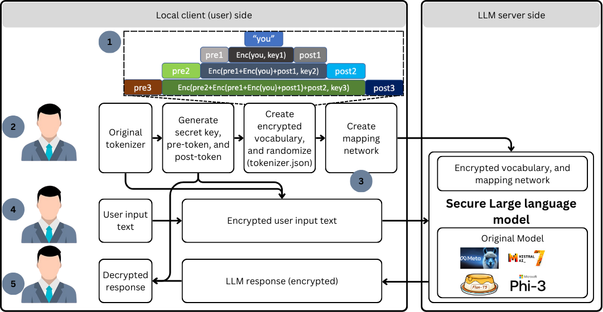

# Type It and Hide It: Large Language Model Inference for End-to-End Secure Communication

This repository is the official implementation of Type It and Hide It: Large Language Model Inference for End-to-End Secure Communication

  

# Requirements

To install requirements:

<pre> pip install -r requirements.txt </pre>

"class_file" directory is a collection of class file with mapping network, corresponding model, encrypted tokenizer, criptographic scheme, and additional code

Create a directory to store models namely "model/" you can put the model including 
1. "Llama-3.2-3B" --> model_name = "llama"
2. "Llama-3.2-3B-Instruct" --> model_name = "llama instruct"
3. "flan-t5-xl" --> model_name = "t5"
4. "Mistral-7B-v0.1" --> model_name = "mistral"
5. "Mistral-7B-Instruct-v0.1" --> model_name = "mistral instruct"
6. "Phi-3.5-mini-instruct" --> model_name = "phi3 instruct"

# Running the code
For running our code to create a secure LLM you need to run step by step, we provide some files with number to be run in an order

  

1. run code for preparing vocabulary encryption ("1. vocabulary encryption.ipynb")
2. run code for creating mapping networks ("2. create mapping network.ipynb")
3. run code for for testing encryption and decryption mechanism without API service ("3. inference secure model.ipynb")

### 1. vocabulary encryption.ipynb
In this code, you just need to run the code in an environtment with changing the model_name with the model that you have, and the result of this proses is 2 directories for user side as secret configurations.
1. "private_model" will be contained encrypted tokenizer, regular expression pattern
2. "original_tokenizer" will be contained original tokenizer from original model (without the model)

### 2. create mapping network.ipynb
In this code, you just need to run the code in an environtment with changing the model_name with the model that you have in step 1, and the result of this process is 1 directory for server side (LLM). The name of directory is "inference_model" that will be contained encrypted tokenizer, regular expression pattern and mapping network. 

  

Table 1. Training time and accuracy of adapter network based on size of vocabulary
| Vocab size | hidden size   | train time (s) | accuracy (\%)   | incorrect mapping |
|------------|---------------|----------------|-----------------|-------------------|
| 32k        | 16            | 6              | 42.16           | 18510             |
| 32k        | 32            | 7              | 91.43           | 2742              |
| 32k        | 64            | 9              | 99.83           | 56                |
| 32k        | 128           | 14             | 99.99           | 2                 |
| 32k        | **256**       | **24**         | **100.00**      | 0                 |
| 32k        | **1024**      | **80**         | **100.00**      | 0                 |
| 128k       | 16            | 112            | 50.07           | 64044             |
| 128k       | 32            | 128            | 93.82           | 7922              |
| 128k       | 64            | 168            | 99.96           | 50                |
| 128k       | 128           | 252            | 99.998          | 2                 |
| 128k       | **256**       | **342**        | **100.00**      | 0                 |
| 128k       | **1024**      | **1260**       | **100.00**      | 0                 |

The optimum number of nodes in each hidden layer of the adapter network is 256, taking into account the number of incorrect token mappings, training time, accuracy, and evaluation benchmark for both the secure base model and the secure instruct model.

Table 2. Evaluation of Secure Llama 3.2 3B base with several hidden size
| Model                     | MMLU           | ARC-C          | AGIEval        | SQuAD          |
|---------------------------|----------------|----------------|----------------|----------------|
| Llama 3.2 3B              | 58             | 69.1           | 39.2           | 67.7           |
| Secure Llama 16 hidden    | 3.35           | 3.91           | 6.31           | 0.00           |
| Secure Llama 32 hidden    | 56.20          | 68.13          | 38.56          | 53.08          |
| Secure Llama 64 hidden    | 56.71          | 69.01          | 39.12          | 66.57          |
| Secure Llama 128 hidden   | 56.71          | 69.01          | 39.12          | 66.57          |
| Secure Llama 256 hidden   | **56.71**      | **69.01**      | **39.12**      | **66.57**      |
| Secure Llama 1024 hidden  | **56.71**      | **69.01**      | **39.12**      | **66.57**      |

Table 3. Evaluation of secure Llama 3.2 3B instruct with several hidden size
| Model                                 | MMLU           | ARC-C          | Hellaswag      | Open-rewrite   | GPQA           |
|---------------------------------------|----------------|----------------|----------------|----------------|----------------|
| Llama 3.2 3B Inst                     | 63.4           | 78.6           | 69.8           | 40.1           | 32.8           |
| Secure Llama Inst 16 hidden           | 0.00           | 0.00           | 0.02           | 14.28          | 0.00           |
| Secure Llama Inst 32 hidden           | 62.19          | 77.40          | 68.34          | 38.87          | 32.81          |
| Secure Llama Inst 64 hidden           | 63.07          | 78.34          | 69.72          | 39.94          | 33.41          |
| Secure Llama Inst 128 hidden          | 63.44          | 78.63          | 70.09          | 40.11          | 33.93          |
| Secure Llama Inst 256 hidden          | **63.44**      | **78.63**      | **70.09**      | **40.11**      | **33.93**      |
| Secure Llama Inst 1024 hidden         | **63.44**      | **78.63**      | **70.09**      | **40.11**      | **33.93**      |

### 3. inference secure model.ipynb
In this code, you just need to run the code in an environtment with changing the model_name with the model that you have in step 1 and 2, and the inference of secure LLM is executed.

# Result
The secure LLM evaluated on several models and dataset

Table 6. Evaluation of Secure LLM base model on several datasets
| Model                     | MMLU         | ARC-C             | AGIEval         |
|---------------------------|--------------|-------------------|-----------------|
| Flan T5-XL                | **52.4**     | **73.05**         | **43.48**       |
| Llama 3.2 3B              | **58**       | **69.1**          | **39.2**        |
| Mistral-7B V0.1           | 60.1         | 67.9              | 42.5            |
| Secure Flan T5-XL         | 49.29        | **73.05**         | **43.48**       |
| Secure Llama 3.2 3B       | 56.71        | 69.01             | 39.12           |
| Secure Mistral-7B V0.1    | **62.61      | **71.76**         | **44.23**       |

Table 7. Evaluation of Secure LLM instruct models on several datasets
| Model                             | MMLU           | Hellaswag      | ARC-C          |
|-----------------------------------|----------------|----------------|----------------|
| Llama 3.2 3B Instruct             | 63.4           | 69.8           | 78.6           |
| Phi 3.5 mini instruct             | **68.8**       | 76.7           | 84.9           |
| Mistral 7B Instruct v0.1          | 53.34          | **64.11**      | **63.60**      |
| Secure Llama 3.2 3B Instruct      | **63.44**      | **70.09**      | **78.63**      |
| Secure Phi 3.5 mini instruct      | 68.19          | **77.28**      | **86.44**      |
| Secure Mistral 7B Instruct v0.1   | **53.51**      | **64.11**      | **63.60**      |

# Conclusion

Proposes an innovative mechanism that utilizes an efficient trained adapter network integrates with an LLM for producing a secure LLM. It is capable of facilitating end-to-end secure communication between the user and the model by requiring minimal resources and time to establish a secure configuration. All secure models implemented in this research provide evaluation results on various datasets that are approximately 3\% lower or 4\% higher than the original benchmark.